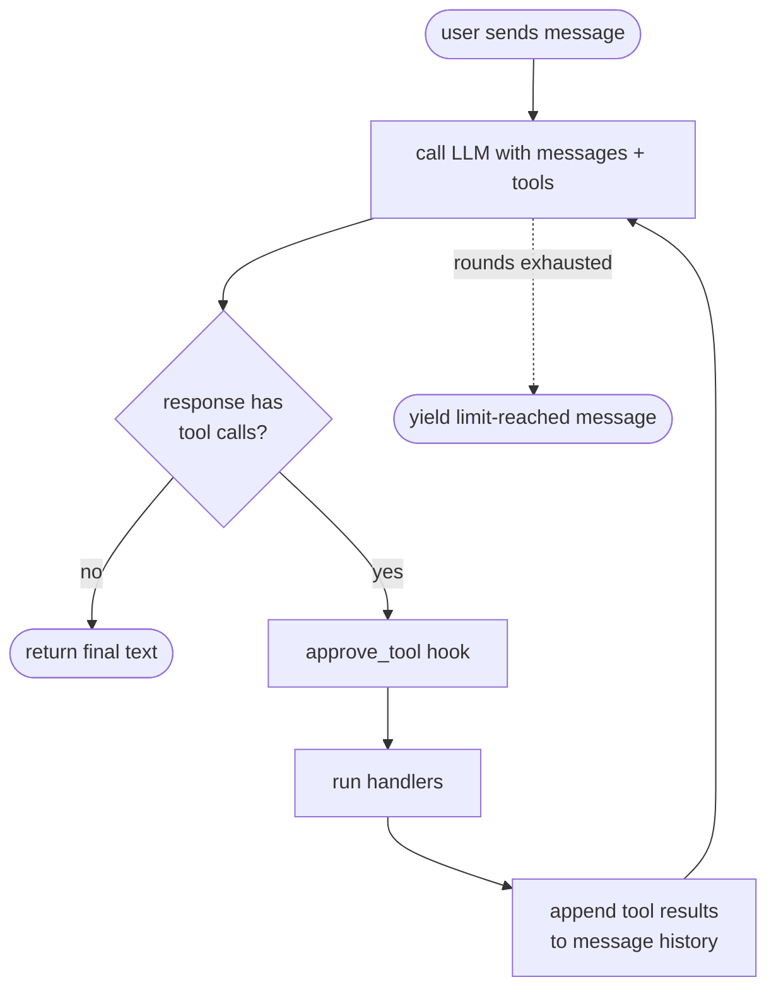

# Agents

`AgentSession` is the agentic loop built on top of the unified chat interface. Given a client, a system prompt, and zero or more tools, it repeatedly calls the LLM, dispatches any tool calls the model requests, feeds the results back, and keeps going until the model produces a plain text answer (or a round limit is hit).

## The loop



Each iteration of the loop is called a **round**. Tool lists are re-read at the top of every round, so MCP servers that emit `notifications/tools/list_changed` (and refresh `McpStreamable.tools` / `McpStdio.tools` in place) get picked up without restarting the session.

With `output=` set (see [Typed answers](#typed-answers)), the round limit and a text answer without a tool call both raise `OutputError` instead of yielding a limit-reached message. `Dispatch` above runs each handler wrapped by the `on_tool` context manager, if set.

## Quick start

```python
from padwan_ai import AgentSession, LLMClient, McpStdio

async with AgentSession(
    client=LLMClient(model="gpt-4o"),
    mcp_tools=[McpStdio(command="uvx", args=["weather-mcp"])],
    system="You are a weather assistant.",
) as session:
    text = await session.send("What's the weather in Paris?")
    print(text)
```

Two entry points, depending on whether you want the response streamed:

- `await session.send(user_input)` — returns the complete text as a string.
- `async for chunk in session.stream(user_input)` — yields text chunks as the model produces them. Tool calls are silent on the stream; observe them via `on_tool`.

`user_input` is plain text or a `list[ContentPart]` for multimodal input (text + images).

## Tools: individual or whole transports

`mcp_tools` accepts a heterogeneous list of `McpTool` and `McpTransport` (i.e. `McpStreamable` / `McpStdio`) instances. This is the main ergonomic win over managing transports by hand:

```python
from padwan_ai import AgentSession, LLMClient, McpStdio, McpStreamable, McpTool

weather_tool = McpTool(
    name="get_weather",
    description="Return current weather for a city.",
    input_schema={"type": "object", "properties": {"city": {"type": "string"}}},
    handler=lambda args: {"city": args["city"], "temp": 22, "sky": "sunny"},
)

async with AgentSession(
    client=LLMClient(model="gpt-4o"),
    mcp_tools=[
        weather_tool,  # local definition
        McpStdio(command="uvx", args=["filesystem-mcp", "/home/me/docs"]),  # subprocess
        McpStreamable(url="https://tools.example.com/mcp", token="sk-..."),  # remote
    ],
) as session:
    text = await session.send("Summarize the README and check the forecast.")
```

On `__aenter__` the session enters every transport that isn't already open (via an `AsyncExitStack`) — a transport passed in already open is only pinged, so the session won't tear it down on exit — then pings each one to prove the connection is live, and fires the optional `on_mcp_connect` callback with the transport instance. `on_mcp_connect` may be sync or async; an async callback is awaited. Every transport the session entered is torn down in LIFO order on exit — even if one of them fails to initialize or ping.

### Name collisions

If two tools end up with the same name (e.g. two MCP servers both expose `search`), `AgentSession` auto-prefixes the colliding **transports** with their `auto_prefix` — a name derived from the transport's identity (URL host for `McpStreamable`, `args[0]`/command basename for `McpStdio`) — unless the transport already has an explicit `name_prefix` set, which always wins. Local `McpTool` instances are never auto-prefixed. If a collision remains after auto-prefixing (two local tools sharing a name, two transports with the same derived prefix, or an explicit prefix that still collides), `AgentSession` raises `ValueError`.

## Tools from typed functions

Writing a JSON Schema by hand for every local tool gets old.
`tool()` builds an `McpTool` from a typed async function:

- the signature is the schema
- the docstring the description
- the arguments the model sends are validated before the function runs

Validation needs either `msgspec` or `pydantic` installed (neither is a dependency
of padwan-ai).

```python
from padwan_ai.tools import tool


async def get_weather(city: str, unit: str = "celsius") -> dict:
    """Return current weather for a city."""
    return {"city": city, "temp": 22, "unit": unit}


weather_tool = tool(get_weather)  # `city` required, `unit` optional
```

### Picking the validator

With no `validator=`, `tool()` follows the annotations: a `msgspec.Meta` constraint
or `Struct` type picks msgspec, a `pydantic.Field` constraint or `BaseModel` type
picks pydantic.

=== "msgspec"

    ```python
    from typing import Annotated
    import msgspec


    class Ref(msgspec.Struct):
        id: int
        name: str


    async def search(
        query: str, limit: Annotated[int, msgspec.Meta(ge=1, le=10)] = 5
    ) -> list[Ref]:
        """Search the references by name."""
        return [Ref(id=1, name=query)]


    search_tool = tool(search)  # `limit` carries minimum/maximum in the schema
    ```

=== "pydantic"

    ```python
    from typing import Annotated
    import pydantic


    class Ref(pydantic.BaseModel):
        id: int
        name: str


    async def read(ref_id: Annotated[int, pydantic.Field(ge=1)]) -> Ref | None:
        """Read one reference."""
        return Ref(id=ref_id, name="EXCAVATOR 20-22T")


    read_tool = tool(read)  # the model is dumped to JSON data
    ```

A signature of plain types uses the only library installed and raises when both
are (pydantic is often pulled in by another SDK). Pass `validator=` to choose, or
any object implementing `ToolValidator` to plug in another library:

```python
tool(get_weather, validator="msgspec")
# MyValidator implements compile(name, fields), adapt(cls) and dump(result)
tool(get_weather, validator=MyValidator())
```

Malformed arguments raise the chosen library's `ValidationError` inside the handler,
which `AgentSession` reports to the model as a tool error like any other exception.
The other library's constraint metadata is ignored. Results are dumped with
`msgspec.to_builtins` / `pydantic_core.to_jsonable_python`, so structs, models and
dataclasses reach the model as plain JSON data; a result the chosen library cannot
serialise is reported as a tool error.

## Typed answers

An agent that must end on data, not prose, sets `output=AgentOutput(cls)` and calls `run()` instead of `send()`. 
The model sees one extra tool, `submit` (rename it with `AgentOutput(tool=)`), whose parameters are the answer's JSON Schema; the loop ends when a call to it validates, and `run()` returns the instance.

```python
from typing import Literal

import msgspec

from padwan_ai import AgentOutput, AgentSession


class Triage(msgspec.Struct):
    priority: Literal["low", "normal", "urgent"]
    team: str
    summary: str


async with AgentSession(
    client=client, mcp_tools=[search_tool], output=AgentOutput(Triage)
) as session:
    triage = await session.run("Checkout returns a 500 since 9am, payments are blocked")
```

`run()` is typed: `AgentSession(output=AgentOutput(Triage))` is an `AgentSession[Triage]`, so `triage` is a `Triage` for the type checker too.

The answer class is a `msgspec.Struct` or a `pydantic.BaseModel`, validated by its own library through the same backends as `tool()`.

An invalid `submit` (a failed validation, or arguments that are not JSON) goes back to the model as the tool result, with the error, up to `AgentOutput(max_repairs=)` times (1 by default); one more failure raises `OutputError`. A text answer without `submit`, or the round limit, raise `OutputError` too: a typed run never returns prose. `OutputError.attempts` and `.details` say what happened.

The first accepted answer, or the exhausted repair budget, settles the run: a second `submit` in the same round is answered with an error and ignored. Other tools called alongside `submit` still run (their results are recorded, the model just gets no further round). `submit` is dispatched like any tool, so `approve_tool` and `on_tool` see it; a denial doesn't consume a repair — the model may call `submit` again in a later round, and the run only hits the round limit if every attempt is denied.

## Configuration

```python
AgentSession(
    client=...,  # any ChatClient — an async context manager with stream_chat() (e.g. LLMClient(model=...) or a ScriptedClient in tests)
    system=None,  # system prompt, stored in ConversationState
    mcp_tools=[],  # McpTool | McpTransport instances
    max_tool_rounds=5,  # round cap; None = unbounded (use with care)
    max_tool_result_chars=8_000,  # truncate tool results sent to the LLM; None = no limit
    execution="sequential",  # "sequential" or "parallel"
    on_tool=None,  # (ToolCallContext) -> context manager wrapping the dispatch
    on_tool_error=None,  # custom error formatter — see below
    approve_tool=None,  # pre-execution hook returning bool | Awaitable[bool]
    on_mcp_connect=None,  # fired per MCP transport after entering + pinging
    extra_params=None,  # extra fields merged verbatim into every request body
    session_id=...,  # auto-generated; override to resume a saved session
    store=None,  # optional ConversationStore for persistence
    output=None,  # AgentOutput(cls, ...) for a typed answer through run() — see above
)
```

### Parallel tool execution

When a single LLM response contains multiple tool calls, `execution="parallel"` dispatches them via `asyncio.gather`. Results are still appended to the message history in original call order:

```python
session = AgentSession(
    client=LLMClient(model="gpt-4o"),
    mcp_tools=[...],
    execution="parallel",
)
```

Use the default `"sequential"` if you care about ordering side effects or want to rate-limit the downstream servers.

### Approval hooks

`approve_tool` runs before every tool dispatch. Return `False` to block the call — the agent will append `{"error": "Tool call denied by approval hook: <name>"}` as the result instead of executing the handler. The hook may be sync or async:

```python
def prompt_user(tool, args):
    return input(f"Run {tool.name}({args})? [y/N] ").lower() == "y"


session = AgentSession(
    client=LLMClient(model="gpt-4o"),
    mcp_tools=[...],
    approve_tool=prompt_user,
)
```

### Error handling

By default, exceptions raised inside a tool handler are caught, formatted as JSON `{"error": str(exc)}`, and appended as the tool result so the model can recover. Override `on_tool_error` to customize:

```python
def format_error(tool, args, exc):
    return f"[{tool.name} failed: {type(exc).__name__}: {exc}]"


session = AgentSession(
    client=...,
    mcp_tools=[...],
    on_tool_error=format_error,
)
```

### Observation

`on_tool` receives a `ToolCallContext(name, args)` and must return a context manager wrapped around each tool dispatch. Use it for logging, UI updates, metrics, or span/timer scopes that need to bracket the call:

```python
from contextlib import contextmanager


@contextmanager
def log_call(tc):
    print(f"→ {tc.name}({tc.args})")
    yield
    print(f"← {tc.name} done")


session = AgentSession(..., on_tool=log_call)
```

For a fire-and-forget side-effect, `yield` immediately after the action.

## Persistence

Conversation state can be saved to any backend via the `ConversationStore` protocol:

```python
import json
from pathlib import Path

from padwan_ai import ConversationSnapshot, ConversationStore


class JsonStore:
    def __init__(self, path: Path):
        self.path = path

    def save(self, session_id: str, snapshot: ConversationSnapshot) -> None:
        (self.path / f"{session_id}.json").write_text(json.dumps(snapshot))

    def load(self, session_id: str) -> ConversationSnapshot:
        file = self.path / f"{session_id}.json"
        if not file.exists():
            raise LookupError(session_id)
        return json.loads(file.read_text())
```

`load()` must raise `LookupError` for a missing snapshot — that's the only exception `AgentSession.load()` treats as "no snapshot yet" and starts fresh from; anything else propagates.

Persist after a turn completes:

```python
async with AgentSession(
    client=LLMClient(model="gpt-4o"),
    store=JsonStore(Path("./sessions")),
    session_id="user-42",
    system="...",
) as session:
    await session.send("Hi!")
    session.save()
```

Resume in a later process with the classmethod constructor:

```python
async with AgentSession.load(
    model="gpt-4o",
    store=JsonStore(Path("./sessions")),
    session_id="user-42",
) as session:
    await session.send("What were we talking about?")
```

`load()` pulls the `system` prompt and full message history from the snapshot. Pass `client=` instead of `model=` when you need a pre-configured or fake client (e.g. in tests).

`session_id` is optional — omit it to start a fresh session that's still wired up to the store, so a later `session.save()` lands under an auto-generated id:

```python
async with AgentSession.load(model="gpt-4o", store=store) as session:
    await session.send("Hello!")
    session.save()  # persisted under session.session_id
```

## How tool results are fed back

When the LLM response contains tool calls, the agent:

1. Appends an `AssistantToolMessage` with all tool calls to the history.
2. Parses each call's arguments from JSON and asks `approve_tool` (if set) — sequentially, even in `execution="parallel"` mode. Denied calls get `{"error": "Tool call denied by approval hook: <name>"}` as their result.
3. Runs the handlers (sequentially or in parallel), each wrapped in the `on_tool` context manager if set — including denied and unknown-tool calls.
4. Catches any exception; without `on_tool_error` the default is JSON `{"error": str(exc)}`.
5. Appends a `ToolResultMessage` per call, in the original order.
6. Loops back to the LLM call.

Long tool results are truncated to `max_tool_result_chars` **in the copy sent to the LLM only**; the full content is preserved in `session.messages` for inspection or persistence.

## Reading state

```python
session.messages  # full ChatMessage list including tool calls + results
session.last_usage  # UsageToken from the most recent LLM call
session.total_usage  # accumulated usage across all rounds in this session
```

`session.add_user_message(text)` appends a user turn without running a round; `session.clear()` drops all messages. Both are for managing history by hand outside `send()`/`stream()`.

## Testing an agent

`padwan_ai.testing.ScriptedClient` stands in for any client: it answers each round with the next `Step` of a script and records what the model would have seen, so a test asserts on the conversation as well as on the outcome (no provider, key or socket needed).

```python
from padwan_ai import AgentSession, McpTool
from padwan_ai.testing import ScriptedClient, Step

# round 1: the model calls a tool, round 2: it answers
client = ScriptedClient(
    [
        Step(tool_calls=[("get_weather", {"city": "Paris"})]),
        Step(text="Sunny in Paris."),
    ]
)
async with AgentSession(client=client, mcp_tools=[weather_tool]) as session:
    assert await session.send("Weather in Paris?") == "Sunny in Paris."

# the tool result went back to the model, and the whole script ran
assert client.requests[1].messages[-1]["role"] == "tool"
assert client.remaining == 0
```

`Step(usage=...)` overrides the default token counts for that round; `Request.tool_names` is a shortcut for the names of the tools offered that round (derived from `Request.tools`).

A script that runs out raises `AssertionError` on the next round: a test that drifts from its script fails loudly instead of hanging on an empty answer. `complete_chat` is scripted the same way for non-streaming callers.

## Limitations

- **No mid-stream approval.** `ChatStream.tool_calls` is only populated after iteration completes, so `approve_tool` runs once all tool calls for a round are known.
- **Untyped tool results.** Results are normalized to strings (MCP wire format, plain strings, JSON fallback).
- **No per-call cancellation.** You can cancel the whole `session.send()` / `session.stream()` task, but not an individual in-flight tool call.
